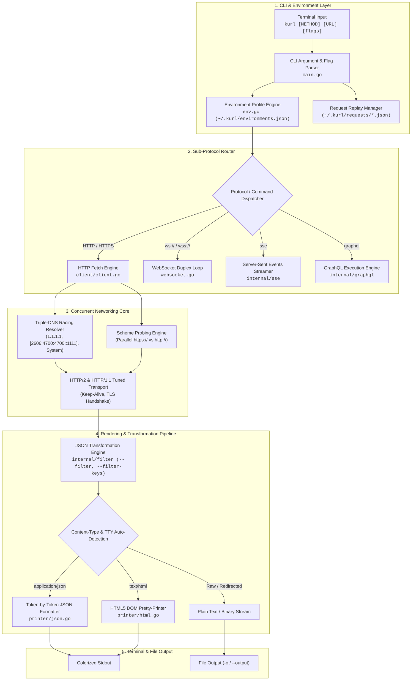
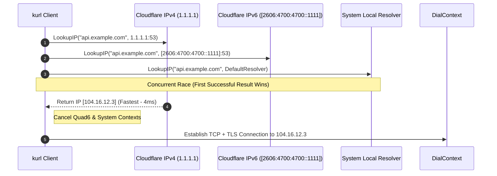
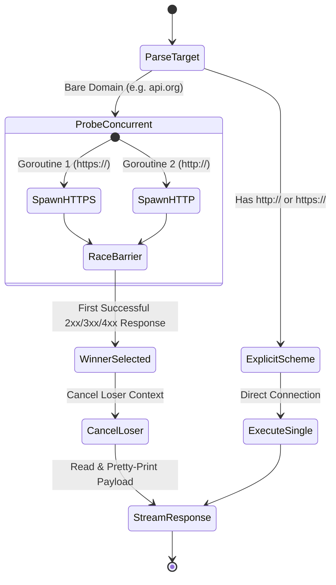

# Architecture & Technical Design

This document details the software architecture, runtime flow, and concurrent sub-systems of `kurl`.

---

## 1. High-Level Architecture Overview

The diagram below illustrates the end-to-end processing pipeline of `kurl`, from CLI command parsing and profile resolution down to concurrent DNS racing, network transports, protocol sub-engines (HTTP, WebSockets, SSE, GraphQL), and smart output formatting.

---

## 2. Multi-Threaded Concurrent Resolver Architecture

`kurl` eliminates VPN and local DNS hang latencies by dispatching 3 concurrent resolution requests for every domain name. Whichever resolver returns a valid IP first cancels the remaining goroutine contexts and immediately proceeds to socket connection dialing.

---

## 3. Scheme Probing Engine Workflow

When passed a bare domain (`kurl example.com`), `kurl` executes concurrent HTTP and HTTPS probes to eliminate scheme guessing latencies:

---

## 4. Sub-System Details & Industrial Design Standards

### A. Zero-Allocation Token-by-Token JSON Formatter
Traditional JSON formatters unmarshal entire documents into memory maps or struct trees before pretty-printing, resulting in high memory churn and loss of original key ordering. `kurl` utilizes an **on-the-fly streaming token parser**:
* **Allocation Caching**: Uses a pre-allocated depth indentation buffer array (`[32][]byte`) to eliminate string formatting allocations (`fmt.Sprintf`) per JSON key/val token.
* **Color Harmony**: Highlighting tokens (`Cyan` keys, `Green` strings, `Yellow` numbers/booleans, `Bold Red` nulls) streamed directly via `io.WriteString`.

### B. Smart HTML5 DOM Pretty-Printer
* **Inline Node Collapsing**: Detects inline tags (`<b>`, `<i>`, `<a>`, ``, etc.) and collapses them onto single lines to prevent vertical output bloat.
* **Malformed HTML Guarding**: Maintains AST stack depth boundaries to safely format unclosed or legacy HTML tags without panic underflows.

### C. JSON Path Transformation Engine (`internal/filter`)
Provides jq-like filtering directly inside `kurl`:
* **Path Slicing (`--filter`)**: Evaluates property paths (`.users[0].name`).
* **CSV Projection (`--filter-keys`)**: Filters keys from objects or arrays (`name, email, role`).
* **Array Flattening (`--filter-flatten`)**: Unnests multi-dimensional array payloads before formatting.

### D. Server-Sent Events (SSE) Streaming Engine (`internal/sse`)
* **W3C EventSource Standard**: Parses multiline `data:` buffers, `event:` classifications, `id:` tracking tags, and `retry:` interval durations.
* **Real-time Colorized Terminal Output**: Live streams events with high-resolution timestamps (`15:04:05`) and optional event-type filtering (`--sse-filter`).

### E. GraphQL Native Integration (`internal/graphql`)
* **Payload Serialization**: Wraps queries and variable JSON payloads (`--variables`) into standard POST HTTP requests.
* **Introspection & Code Generation**: Auto-generates template queries via `--generate-query <Type>` and executes full schema introspection (`--introspect`).

---

## 5. Security & TTY Environment Control

* **Directory Traversal Protection**: Replay request profile names (`kurl save <name>`) are sanitized with strict alphanumeric, hyphen, and underscore validation rules (`isValidRequestName`).
* **Smart TTY Detection**: Uses `os.ModeCharDevice` check on `stdout`. When redirected to files or pipes, ANSI color codes are stripped silently to ensure clean text output. Natively supports the `NO_COLOR` standard.

